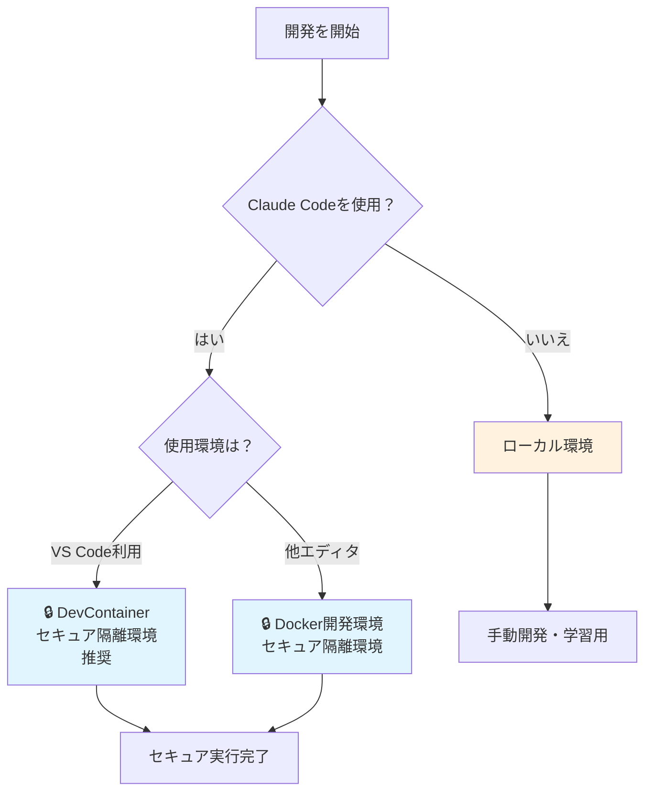

# ドキュメントガイド

Claude Code + フルスタック開発テンプレートのドキュメント案内です。

## 🔒 セキュリティファースト開発

このテンプレートは Claude Code の安全な実行を最優先に設計されています。

### 環境選択フローチャート

### 重要な原則

- **Claude Code使用時**: 必ずセキュア環境（DevContainer/Docker）
- **手動開発時**: ローカル環境でも可（パフォーマンス重視）
- **デフォルト**: すべてのコンテナ環境は SECURE_MODE=true

## 📚 ドキュメント構成

### 🚀 クイックスタート

| ドキュメント                 | 説明                       | 対象者            |
| ---------------------------- | -------------------------- | ----------------- |
| [README.md](../README.md)    | プロジェクト概要・環境選択 | 全員必読          |
| [TUTORIAL.md](./TUTORIAL.md) | Claude Code実践ガイド      | Claude Code利用者 |

### 🔧 環境構築

| ドキュメント                                                                                       | 説明                             | 対象者                         |
| -------------------------------------------------------------------------------------------------- | -------------------------------- | ------------------------------ |
| [DevContainer ガイド](environment/devcontainer.md)                                                 | VS Code DevContainer設定         | VS Code利用者                  |
| [Docker ガイド](environment/docker.md)                                                             | Docker開発環境設定               | 任意エディタ利用者             |
| [README: Web ダッシュボード手順](../README.md#web-ダッシュボードで-4-分割ワークスペースを利用する) | ブラウザで使える Docker 開発環境 | Claude Code をブラウザから操作 |
| [セキュリティ設定](environment/security.md)                                                        | ネットワーク制限・セキュリティ   | セキュリティ重視               |
| [インストールガイド](getting-started/installation.md)                                              | 詳細セットアップ                 | 手動構築希望者                 |

### 🏗️ 開発・設計

| ドキュメント                                  | 説明                | 対象者         |
| --------------------------------------------- | ------------------- | -------------- |
| [アーキテクチャ](development/architecture.md) | 技術構成と設計思想  | 開発者・設計者 |
| [API開発](development/api-development.md)     | 従来的な開発手法    | 手動開発者     |
| [MCP統合](environment/mcp-servers.md)         | Claude Code拡張設定 | 上級利用者     |

## 🎯 目的別ガイド

### Claude Codeで即座に開発開始

1. [README.md](../README.md) - 環境選択
2. [README.md](../README.md#web-ダッシュボードで-4-分割ワークスペースを利用する) -
   Web ダッシュボード起動
3. [TUTORIAL.md](./TUTORIAL.md) - Claude Code 実行手順
4. 開発開始

#### Web ベース Docker ワークスペースの概要

- `pnpm run docker:dashboard`（もしくは `pnpm run docker:dashboard -- -d`）でセ
  キュア開発コンテナを起動
- ブラウザで <http://localhost:8080> にアクセスして 2x2 レイアウトを利用（認証な
  し - ローカル開発専用）
- VS Code / ターミナルは従来の Docker セキュア環境と同じコンテナに接続
  し、`claude` CLI もそのまま利用可能
- 終了時は `pnpm run docker:dashboard:down` を実行

### VS Code DevContainerを詳しく知りたい

1. [DevContainer ガイド](environment/devcontainer.md) - 完全ガイド
2. [セキュリティ設定](environment/security.md) - ネットワーク制限詳細

### 他エディタでClaude Codeを使いたい

1. [Docker ガイド](environment/docker.md) - セキュア隔離環境
2. [インストールガイド](getting-started/installation.md) - セットアップ詳細

### 手動開発・技術詳細を知りたい

1. [アーキテクチャ](development/architecture.md) - 技術構成
2. [API開発](development/api-development.md) - 従来開発手法
3. [インストールガイド](getting-started/installation.md) - ローカル環境構築

## ⚠️ セキュリティ注意事項

### 絶対に避けるべきこと

- ローカル環境での Claude Code 直接実行は禁止
- SECURE_MODE=false での Claude Code 使用は禁止
- 本番環境での開発・テスト実行は禁止

### 推奨事項

- DevContainer/Docker でのセキュア実行を推奨
- 外部 API 利用時の追加ドメイン設定を推奨
- 定期的なセキュリティ設定見直しを推奨

## 🔗 外部リンク

- [Claude Code 公式ドキュメント](https://docs.anthropic.com/en/docs/claude-code)
- [Docker公式ドキュメント](https://docs.docker.com/)
- [VS Code DevContainer](https://code.visualstudio.com/docs/devcontainers/containers)

---

質問や問題がある場合は、プロジェクトの Issue で報告してください。
