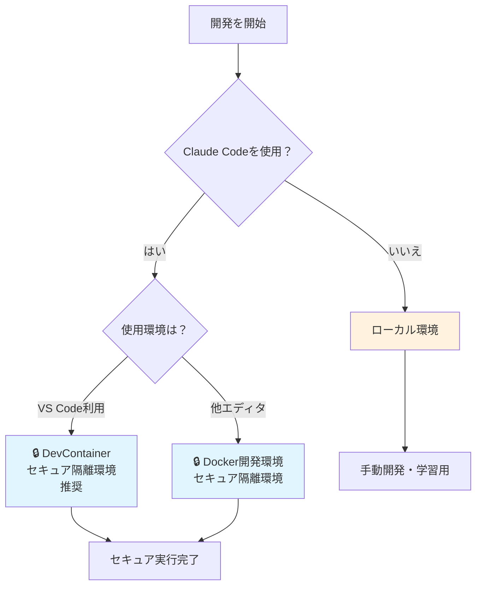

# ドキュメントガイド

Claude Code + フルスタック開発テンプレートのドキュメント案内です。

## 🔒 セキュリティファースト開発

このテンプレートは**Claude Codeの安全な実行**を最優先に設計されています。

### 環境選択フローチャート

### 重要な原則

- **Claude Code使用時**: 必ずセキュア環境（DevContainer/Docker）
- **手動開発時**: ローカル環境でも可（パフォーマンス重視）
- **デフォルト**: すべてのコンテナ環境は SECURE_MODE=true

## 📚 ドキュメント構成

### 🚀 クイックスタート

| ドキュメント                      | 説明                            | 対象者                |
| --------------------------------- | ------------------------------- | --------------------- |
| **[README.md](../README.md)**     | プロジェクト概要・3つの環境選択 | **全員必読**          |
| **[TUTORIAL.md](../TUTORIAL.md)** | Claude Code実践ガイド           | **Claude Code利用者** |

### 🔧 環境構築

| ドキュメント                                              | 説明                               | 対象者             |
| --------------------------------------------------------- | ---------------------------------- | ------------------ |
| **[DevContainer ガイド](environment/devcontainer.md)**    | VS Code DevContainer設定           | VS Code利用者      |
| **[Docker ガイド](environment/docker.md)**                | Docker開発環境設定                 | 任意エディタ利用者 |
| **[セキュリティ設定](environment/security.md)**           | ネットワーク制限・ファイアウォール | セキュリティ重視   |
| **[インストールガイド](getting-started/installation.md)** | 詳細セットアップ手順               | 手動構築希望者     |

### 🏗️ 開発・設計

| ドキュメント                                      | 説明                | 対象者         |
| ------------------------------------------------- | ------------------- | -------------- |
| **[アーキテクチャ](development/architecture.md)** | 技術構成と設計思想  | 開発者・設計者 |
| **[API開発](development/api-development.md)**     | 従来的な開発手法    | 手動開発者     |
| **[MCP統合](environment/mcp-servers.md)**         | Claude Code拡張設定 | 上級利用者     |

## 🎯 目的別ガイド

### Claude Codeで即座に開発開始

1. **[README.md](../README.md)** - 環境選択
2. **[TUTORIAL.md](../TUTORIAL.md)** - セキュア実行方法
3. 開発開始！

### VS Code DevContainerを詳しく知りたい

1. **[DevContainer ガイド](environment/devcontainer.md)** - 完全ガイド
2. **[セキュリティ設定](environment/security.md)** - ネットワーク制限詳細

### 他エディタでClaude Codeを使いたい

1. **[Docker ガイド](environment/docker.md)** - セキュア隔離環境
2. **[インストールガイド](getting-started/installation.md)** - セットアップ詳細

### 手動開発・技術詳細を知りたい

1. **[アーキテクチャ](development/architecture.md)** - 技術構成
2. **[API開発](development/api-development.md)** - 従来開発手法
3. **[インストールガイド](getting-started/installation.md)** - ローカル環境構築

## ⚠️ セキュリティ注意事項

### 絶対に避けるべきこと

- ❌ ローカル環境での Claude Code 直接実行
- ❌ SECURE_MODE=false での Claude Code 使用
- ❌ 本番環境での開発・テスト実行

### 推奨事項

- ✅ DevContainer/Docker でのセキュア実行
- ✅ 外部 API 利用時の追加ドメイン設定
- ✅ 定期的なセキュリティ設定見直し

## 🔗 外部リンク

- [Claude Code 公式ドキュメント](https://docs.anthropic.com/en/docs/claude-code)
- [Docker公式ドキュメント](https://docs.docker.com/)
- [VS Code DevContainer](https://code.visualstudio.com/docs/devcontainers/containers)

---

**質問・問題報告**: プロジェクトの Issue で報告してください
