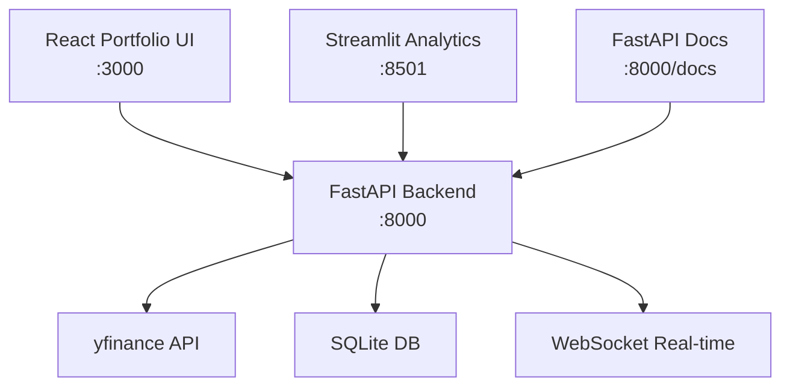

# 株式市場分析プラットフォーム仕様書

## 🎯 プロジェクト概要

### 目的

個人投資家向けに、リアルタイム株価データ分析と高度なポートフォリオ管理を提供する
プラットフォーム

### 成功指標

- **リアルタイムデータ更新**: 遅延1秒以内
- **同時ユーザー**: 100名以上対応
- **データ精度**: 99.9%以上
- **ユーザー満足度**: 4.5/5.0以上

## 👥 ターゲット・ユーザー

### プライマリユーザー: 個人投資家

- **特徴**: デイトレーダー、スイングトレーダー
- **ニーズ**: リアルタイム価格、テクニカル分析、リスク管理
- **技術レベル**: 中級（金融知識あり、ITリテラシー普通）

### セカンダリユーザー: 投資初心者

- **特徴**: 投資学習中、長期投資志向
- **ニーズ**: 教育的コンテンツ、シンプルな分析ツール

## 🏗️ システム・アーキテクチャ

### マルチフロントエンド構成



### 技術スタック

- **Backend**: Python 3.12+ / FastAPI / Pydantic / SQLAlchemy
- **Frontend**: TypeScript / React / Vite
- **Analytics**: Streamlit / Plotly / Pandas / NumPy
- **Database**: SQLite（時系列最適化）
- **Real-time**: WebSocket / Server-Sent Events
- **Data Source**: yfinance / Alpha Vantage（フォールバック）

## 🔧 機能要件

### Must Have（必須機能）

#### F-001: リアルタイム株価データ取得

- **説明**: yfinance API経由での株価データ取得・更新
- **詳細**:
  - OHLCV（始値、高値、安値、終値、出来高）データ
  - 1分〜1日間隔の時系列データ
  - WebSocketによるリアルタイム配信
  - データキャッシング（Redis風のメモリキャッシュ）
- **受入基準**:
  - 1秒以内のデータ更新
  - 99.9%のデータ取得成功率
  - 500銘柄同時監視可能

#### F-002: ポートフォリオ管理（React UI）

- **説明**: 投資ポートフォリオのCRUD操作と管理
- **詳細**:
  - 保有銘柄登録・編集・削除
  - 購入・売却取引記録
  - リアルタイム損益計算
  - ポートフォリオ構成比可視化
- **受入基準**:
  - 取引記録からの自動損益計算
  - ポートフォリオ価値のリアルタイム更新
  - CSV インポート/エクスポート対応

#### F-003: テクニカル分析指標

- **説明**: 主要なテクニカル指標の計算・表示
- **詳細**:
  - **移動平均**: SMA（5, 10, 20, 50日）、EMA（12, 26日）
  - **モメンタム**: RSI、MACD、Stochastic
  - **ボラティリティ**: Bollinger Bands、ATR
  - **出来高分析**: Volume Profile、OBV
- **受入基準**:
  - 各指標の数学的精度検証
  - 計算速度 < 100ms（100日分データ）
  - カスタマイズ可能なパラメータ

#### F-004: 高度分析ダッシュボード（Streamlit）

- **説明**: データ分析・可視化専用インターフェース
- **詳細**:
  - **インタラクティブチャート**: Plotlyローソク足、ヒートマップ
  - **リスク分析**: VaR（Value at Risk）、シャープレシオ、最大ドローダウン
  - **セクター分析**: 業界別パフォーマンス比較
  - **相関分析**: 銘柄間相関マトリックス
- **受入基準**:
  - リアルタイムチャート更新（auto-refresh）
  - エクスポート機能（PNG、PDF、CSV）
  - マルチページ構成での使いやすさ

#### F-005: WebSocket リアルタイム通信

- **説明**: 価格データのリアルタイム配信・同期
- **詳細**:
  - 複数クライアント対応
  - 接続管理・自動再接続
  - 差分更新による効率化
  - レート制限対応
- **受入基準**:
  - 100同時接続対応
  - 1秒以内のデータ配信
  - 接続断時の自動復旧

### Should Have（重要機能）

#### F-101: バックテストシミュレーター

- **説明**: 過去データでの投資戦略検証
- **詳細**:
  - 期間指定でのパフォーマンス計算
  - 複数戦略の比較
  - リスク調整済みリターン算出
- **根拠**: 投資戦略の検証需要が高い

#### F-102: ポートフォリオ最適化

- **説明**: 現代ポートフォリオ理論による最適化
- **詳細**:
  - 効率的フロンティア計算
  - リスク・リターン最適化
  - 制約条件設定（セクター配分等）

### Could Have（追加機能）

#### F-201: アラート・通知機能

- **説明**: 価格・指標による通知システム

#### F-202: 経済指標連携

- **説明**: マクロ経済データとの相関分析

### Won't Have（対象外）

- 実際の取引執行機能（証券会社API連携）
- 個人情報を扱うKYC機能
- 仮想通貨・FX・デリバティブ

## 📊 非機能要件

### パフォーマンス

- **API レスポンス**: 95%ile < 200ms
- **ページロード時間**: 初回 < 3秒、2回目以降 < 1秒
- **データ取得**: yfinance API < 2秒（銘柄あたり）
- **チャート描画**: 1000ポイント < 500ms

### 可用性

- **稼働率**: 99.5%（平日市場時間）
- **データ取得成功率**: 99.9%
- **自動復旧**: 障害検知から30秒以内

### セキュリティ

- **データ暗号化**: HTTPS必須、WebSocket TLS
- **入力検証**: 全API エンドポイントでバリデーション
- **レート制限**: API 1分間100リクエスト/IP
- **ログ記録**: 全アクセス・エラーログ保持

### スケーラビリティ

- **同時ユーザー**: 100名（目標）
- **監視銘柄数**: 500銘柄まで
- **データ保持**: 2年分の日次データ
- **リアルタイム配信**: 100WebSocket接続

## 🧪 受入基準（Gherkinサマリー）

### 基本フロー

```gherkin
シナリオ: リアルタイム株価表示
  前提 ユーザーがダッシュボードにアクセスしている
  もし AAPL銘柄を監視リストに追加する
  ならば 1秒以内に最新価格が表示される
  かつ チャートがリアルタイム更新される
```

### パフォーマンステスト

```gherkin
シナリオ: 大量データ処理
  前提 100銘柄の1年分データが存在する
  もし ポートフォリオ分析を実行する
  ならば 5秒以内に結果が表示される
  かつ メモリ使用量が1GB以下である
```

### エラーハンドリング

```gherkin
シナリオ: データ取得失敗時の対応
  前提 yfinance APIが一時的に利用できない
  もし 株価データを要求する
  ならば キャッシュされた最新データを表示する
  かつ 「データ更新中」の表示が出る
```

## 📈 データモデル設計

### 主要エンティティ

```python
# Stock（株式基本情報）
class Stock(BaseModel):
    symbol: str          # ティッカーシンボル（例：AAPL）
    name: str           # 会社名
    sector: str         # セクター
    market_cap: float   # 時価総額

# StockPrice（株価データ）
class StockPrice(BaseModel):
    symbol: str
    timestamp: datetime
    open: float
    high: float
    low: float
    close: float
    volume: int

# Portfolio（ポートフォリオ）
class Portfolio(BaseModel):
    id: str
    name: str
    holdings: List[Holding]
    created_at: datetime

# Holding（保有銘柄）
class Holding(BaseModel):
    symbol: str
    quantity: int
    average_price: float
    current_value: float

# TechnicalIndicator（テクニカル指標）
class TechnicalIndicator(BaseModel):
    symbol: str
    timestamp: datetime
    sma_5: float
    sma_20: float
    rsi: float
    macd: float
```

## 🔌 API設計（主要エンドポイント）

### 株価データAPI

```yaml
GET /api/stocks/{symbol}/price
# リアルタイム価格取得

GET /api/stocks/{symbol}/history?period=1y&interval=1d
# 過去価格データ取得

GET /api/stocks/{symbol}/indicators
# テクニカル指標取得

WebSocket /ws/stocks/{symbol}
# リアルタイム価格配信
```

### ポートフォリオAPI

```yaml
GET /api/portfolios
# ポートフォリオ一覧

POST /api/portfolios
# ポートフォリオ作成

GET /api/portfolios/{portfolio_id}/performance
# パフォーマンス分析

POST /api/portfolios/{portfolio_id}/transactions
# 取引記録追加
```

## 🚀 実装フェーズ

### Phase 1: 基盤構築（2週間）

- [ ] プロジェクト構造セットアップ
- [ ] yfinance統合・データモデル
- [ ] 基本API（株価取得）
- [ ] PostgreSQL/SQLite セットアップ

### Phase 2: コア機能（3週間）

- [ ] WebSocket リアルタイム配信
- [ ] React ポートフォリオUI
- [ ] テクニカル指標計算エンジン
- [ ] Streamlit 分析ダッシュボード

### Phase 3: 高度機能（2週間）

- [ ] バックテストシミュレーター
- [ ] リスク分析ツール
- [ ] パフォーマンス最適化
- [ ] セキュリティ強化

### Phase 4: 運用準備（1週間）

- [ ] 統合テスト・E2Eテスト
- [ ] デプロイ・監視設定
- [ ] ドキュメント整備

## 📋 使用開始方法

### 開発環境セットアップ

```bash
# 依存関係インストール
bun install
cd backend && uv sync && uv sync --group streamlit && cd -

# 金融データライブラリ追加
uv add yfinance plotly pandas numpy scipy

# 開発サーバー起動（3つ同時）
bun run dev
```

### アクセス先

- 🌐 **React ポートフォリオ管理**: http://localhost:3000
- 🎈 **Streamlit 分析ダッシュボード**: http://localhost:8501
- 📚 **FastAPI 仕様書**: http://localhost:8000/docs
- 🔌 **WebSocket**: ws://localhost:8000/ws/stocks/{symbol}

## ⚠️ リスク・制約

### 技術リスク

- **外部API依存**: yfinance API の利用制限・障害
- **リアルタイムデータ**: WebSocket接続の安定性
- **パフォーマンス**: 大量データ処理の応答性能

### ビジネス制約

- **データ品質**: 無料APIデータの正確性制限
- **法規制**: 金融商品取引法・個人情報保護法への配慮
- **ライセンス**: yfinance の商用利用制限確認要

### 軽減策

- **フォールバック**: 複数データソースの準備
- **キャッシング**: データ取得失敗時の代替表示
- **段階展開**: 機能を段階的にリリース

---

## 📞 実装指示例

### Claude Codeへの実装依頼

```
「specs/examples/stock-analysis-platform.spec.md の仕様に基づいて、
株式市場分析プラットフォームを実装してください。

要件:
- TDDでGherkinテストから開始
- 3つのフロントエンド並列実装（React, Streamlit, FastAPI Docs）
- yfinance統合でリアルタイムデータ取得
- WebSocketによる価格配信
- 型安全性確保（Pydantic ↔ TypeScript）
- 品質ゲート（テスト80%カバレッジ、リント合格）必須」
```

**このように具体的な仕様があることで、Claude Code は効率的で高品質な実装を提供で
きます。**
