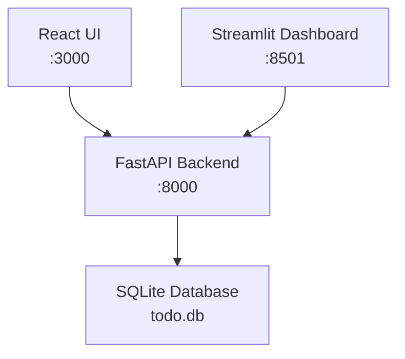

## TODOアプリケーション仕様書

## プロジェクト概要

### 目的

個人のタスク管理を効率化する、シンプルで使いやすい TODO アプリケーションです。

### 成功指標

- 操作の直感性 - 新規ユーザーが 5 分以内に基本操作をマスター
- レスポンス性能 - 全操作が 500ms 以内で完了
- データ永続化 - タスクデータの確実な保存
- ユーザビリティ - タスク完了率の向上

## ターゲット・ユーザー

### プライマリユーザー: 個人ユーザー

- 特徴 - 日常的なタスク管理が必要な社会人・学生
- ニーズ - シンプルなタスク追加・完了・削除機能
- 技術レベル - 初級（基本的なウェブ操作ができる）

### セカンダリユーザー: 小チーム

- 特徴 - 3-5 人の小規模チーム
- ニーズ - 共有タスク管理、進捗の可視化

## システム・アーキテクチャ

### デュアルフロントエンド構成



### 技術スタック

- Backend - Python 3.12+ / FastAPI / Pydantic / SQLAlchemy
- Frontend - TypeScript / React / Vite / CSS Modules
- Analytics - Streamlit / Plotly / Pandas
- Database - SQLite（ファイルベース、シンプル）
- Testing - Pytest / Jest / React Testing Library

## 機能要件

### Must Have（必須機能）

#### F-001: タスクCRUD操作

- 説明 - タスクの作成・読み取り・更新・削除
- 詳細 -
  - 作成 - タイトル必須、説明オプション
  - 読み取り - 全タスク一覧表示
  - 更新 - タイトル・説明・ステータス変更
  - 削除 - 論理削除（実際は完了済みに移動）
- 受入基準 -
  - タスク作成後は即座に一覧表示
  - 文字制限（タイトル 100 文字、説明 500 文字）
  - 必須項目が未入力の場合はエラー表示

#### F-002: ステータス管理

- 説明 - タスクの進行状況管理
- 詳細 -
  - ステータス - 未完了（Pending）/ 完了（Done）
  - ワンクリック完了 - チェックボックス操作
  - 進捗可視化 - 完了率の表示
- 受入基準 -
  - ステータス変更の即座反映
  - 完了タスクの視覚的区別（グレーアウト）
  - 完了率の正確な計算・表示

#### F-003: タスクフィルタリング・検索

- 説明 - タスクの絞り込み・検索機能
- 詳細 -
  - フィルター - 全て / 未完了 / 完了
  - 検索 - タイトル・説明での部分一致検索
  - 並び替え - 作成日、更新日、タイトル順
- 受入基準 -
  - リアルタイム検索（入力中の即座反映）
  - 検索結果の件数表示
  - フィルター状態の保持

#### F-004: データ永続化

- 説明 - タスクデータの確実な保存
- 詳細 -
  - 自動保存 - 操作後の即座保存
  - データベース - SQLite 使用
  - バックアップ - JSON 形式でのエクスポート
- 受入基準 -
  - ブラウザリロード後のデータ保持
  - データ整合性の保証
  - エラー時のデータ保護

#### F-005: 統計ダッシュボード（Streamlit）

- 説明 - タスク管理の分析・可視化
- 詳細 -
  - 完了統計 - 日別・週別・月別の完了数
  - 進捗チャート - 円グラフ、棒グラフでの可視化
  - 生産性分析 - 作業パターンの分析
- 受入基準 -
  - リアルタイムデータ反映
  - インタラクティブなチャート
  - データエクスポート機能（CSV、PNG）

### Should Have（重要機能）

#### F-101: 優先度設定

- 説明 - タスクの重要度・緊急度管理
- 詳細 -
  - 高・中・低の 3 段階優先度
  - 優先度に基づく自動並び替え
  - 視覚的な優先度表示（色分け）

#### F-102: カテゴリ・タグ機能

- 説明 - タスクの分類・ラベリング
- 詳細 -
  - カテゴリ設定（仕事、プライベート等）
  - 複数タグ付与可能
  - カテゴリ・タグでのフィルタリング

### Could Have（追加機能）

#### F-201: 締切日設定・通知

#### F-202: サブタスク機能

#### F-203: チーム共有機能

### Won't Have（対象外）

- ユーザー認証・ログイン機能（V1 では単一ユーザー想定）
- リアルタイム同期（複数デバイス間）
- 高度なプロジェクト管理機能
- 外部カレンダー連携

## 非機能要件

### パフォーマンス

- API レスポンス - 平均 < 100ms
- ページロード時間 - 初回 < 2 秒
- タスク表示 - 1000 件でも < 500ms
- 検索処理 - リアルタイム（< 50ms）

### 可用性

- ローカル動作 - インターネット接続がなくても基本機能が利用可能
- データ損失防止 - 99.99%の信頼性
- エラー復旧 - 操作エラーからの自動復旧

### ユーザビリティ

- 直感的操作 - チュートリアル不要でも使用可能
- レスポンシブデザイン - モバイル・デスクトップ対応
- アクセシビリティ - WCAG 2.1 AA 準拠
- 多言語 - 日本語・英語対応

### セキュリティ

- 入力検証 - 全入力フィールドでバリデーション
- SQL インジェクション対策 - パラメータ化クエリ
- XSS 対策 - 安全なエスケープ処理

## 受入基準（Gherkinサマリー）

### 基本フロー

```gherkin
シナリオ: タスク作成から完了まで
  前提 ユーザーがアプリにアクセスしている
  もし 「買い物に行く」というタスクを作成する
  ならば タスク一覧に新しいタスクが表示される
  かつ 未完了ステータスになっている
  もし そのタスクを完了にマークする
  ならば タスクが完了済み表示になる
  かつ 完了率が更新される
```

### エラーハンドリング

```gherkin
シナリオ: 無効な入力の処理
  前提 ユーザーがタスク作成フォームを開いている
  もし 空のタイトルでタスクを作成しようとする
  ならば エラーメッセージが表示される
  かつ タスクは作成されない
  もし 101文字のタイトルを入力する
  ならば 文字数超過エラーが表示される
```

### パフォーマンステスト

```gherkin
シナリオ: 大量データでの応答性
  前提 500件のタスクが存在する
  もし タスク一覧を表示する
  ならば 500ms以内に全タスクが表示される
  もし 「買い物」で検索する
  ならば 50ms以内に結果が表示される
```

## データモデル設計

### 主要エンティティ

```python
# Task（タスク）
class Task(BaseModel):
    id: int                    # 主キー
    title: str                 # タスクタイトル（必須、1-100文字）
    description: Optional[str] # タスク説明（0-500文字）
    status: TaskStatus         # ステータス（pending/done）
    priority: Priority         # 優先度（high/medium/low）
    created_at: datetime       # 作成日時
    updated_at: datetime       # 更新日時

# TaskStatus（ステータス列挙）
class TaskStatus(str, Enum):
    PENDING = "pending"        # 未完了
    DONE = "done"             # 完了

# Priority（優先度列挙）
class Priority(str, Enum):
    HIGH = "high"             # 高
    MEDIUM = "medium"         # 中
    LOW = "low"               # 低
```

### データベース設計

```sql
-- タスクテーブル
CREATE TABLE tasks (
    id INTEGER PRIMARY KEY AUTOINCREMENT,
    title VARCHAR(100) NOT NULL,
    description TEXT,
    status VARCHAR(20) DEFAULT 'pending',
    priority VARCHAR(20) DEFAULT 'medium',
    created_at TIMESTAMP DEFAULT CURRENT_TIMESTAMP,
    updated_at TIMESTAMP DEFAULT CURRENT_TIMESTAMP
);

-- インデックス
CREATE INDEX idx_tasks_status ON tasks(status);
CREATE INDEX idx_tasks_created ON tasks(created_at);
```

## API設計（主要エンドポイント）

### タスク操作API

```yaml
# タスク一覧取得
GET /api/tasks?status=all&search=&sort=created_at&order=desc

# タスク作成
POST /api/tasks
{
  "title": "タスクタイトル",
  "description": "タスク説明",
  "priority": "medium"
}

# タスク更新
PUT /api/tasks/{task_id}
{
  "title": "更新されたタイトル",
  "status": "done"
}

# タスク削除
DELETE /api/tasks/{task_id}

# 統計情報取得
GET /api/tasks/stats
{
  "total": 100,
  "pending": 20,
  "done": 80,
  "completion_rate": 0.8
}
```

### レスポンス形式

```json
{
  "success": true,
  "data": {
    "id": 1,
    "title": "買い物に行く",
    "description": "牛乳とパンを購入",
    "status": "pending",
    "priority": "medium",
    "created_at": "2024-01-01T10:00:00Z",
    "updated_at": "2024-01-01T10:00:00Z"
  },
  "message": "タスクが正常に作成されました"
}
```

## UI/UXデザイン要件

### React UI（メイン操作画面）

- レイアウト - シンプルな 1 カラムレイアウト
- カラースキーム - 明るくて親しみやすい色合い
- 操作性 - 大きなボタン、タッチフレンドリー
- フィードバック - 操作後の視覚的確認

### Streamlit ダッシュボード（分析画面）

- チャート - 直感的な可視化（円グラフ、棒グラフ）
- インタラクティブ - フィルター・期間選択機能
- エクスポート - PNG、CSV 形式での出力

## 実装フェーズ

### Phase 1: 基盤構築（1週間）

- [ ] プロジェクト構造セットアップ
- [ ] SQLite データベース設計
- [ ] 基本 API（CRUD）実装
- [ ] React 基本コンポーネント作成

### Phase 2: コア機能（1週間）

- [ ] タスク一覧・作成・更新・削除 UI
- [ ] フィルタリング・検索機能
- [ ] ステータス管理・完了機能
- [ ] エラーハンドリング・バリデーション

### Phase 3: 拡張機能（1週間）

- [ ] Streamlit 統計ダッシュボード
- [ ] 優先度・カテゴリ機能
- [ ] データエクスポート・インポート
- [ ] パフォーマンス最適化

### Phase 4: 仕上げ（3日）

- [ ] E2E テスト・統合テスト
- [ ] UI/UX 最終調整
- [ ] ドキュメント整備
- [ ] デプロイ準備

## 使用開始方法

### 開発環境セットアップ

```bash
# 依存関係インストール
pnpm install
cd backend && uv sync && uv sync --group streamlit && cd -

# データベース初期化
cd backend && uv run python -c "from database import init_db; init_db()" && cd -

# 開発サーバー起動
pnpm run dev
```

### アクセス先

- React TODO アプリ：<http://localhost:3000>
- Streamlit ダッシュボード：<http://localhost:8501>
- FastAPI 仕様書：<http://localhost:8000/docs>

## リスク・制約

### 技術リスク

- データ損失 - SQLite ファイル破損のリスク
- パフォーマンス - 大量データでの応答速度
- ブラウザ互換性 - 古いブラウザでの動作保証

### 軽減策

- 定期バックアップ - 自動的なデータエクスポート
- パフォーマンステスト - 定期的な速度測定
- 段階的改善 - 問題発見時の迅速な修正

---

## 実装指示例

### Claude Codeへの実装依頼

```text
「specs/examples/todo-app.spec.md の仕様に基づいて、
TODOアプリケーションを実装してください。

要件:
- TDDでGherkinテストから開始
- React UI + Streamlit ダッシュボードの2画面構成
- SQLite使用、シンプルなCRUD操作
- 型安全性確保（Pydantic ↔ TypeScript）
- 初学者にも理解しやすいコード構造
- テスト80%カバレッジ、リント合格」
```

**シンプルでも完成度の高いアプリケーションを、Claude Code と共に効率的に開発でき
ます。**
